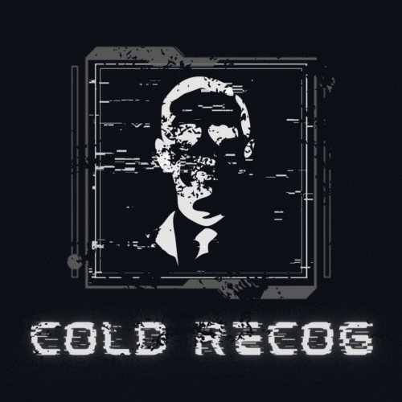
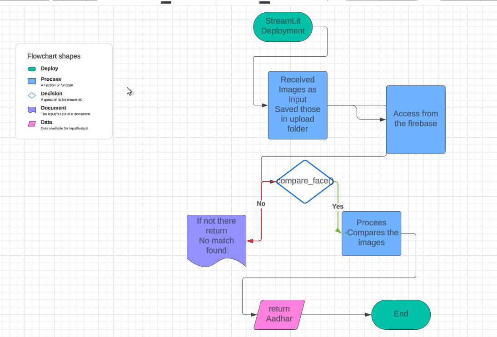
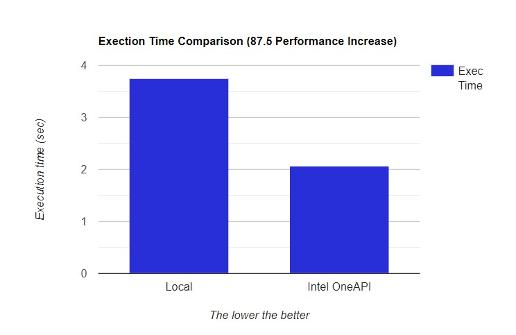
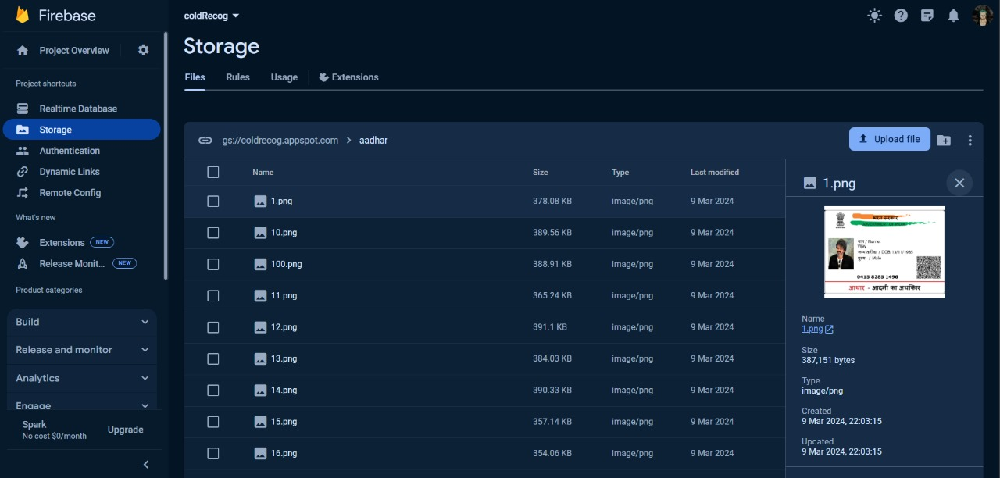
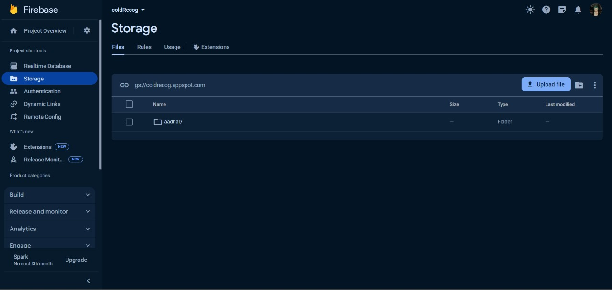

# ColdRecog

<div align="center">
  <a href="https://github.com/Aksshay88/Cold-Recog.git">
    
  </a>
 
[](https://travis-ci.com/limkhashing/Face-Matching)
[](https://codecov.io/gh/limkhashing/Face-Matching)


[](https://github.com/Aksshay88/Cold-Recog/graphs/contributors)
[](https://github.com/Aksshay88/Cold-Recog/network/members)
[](https://github.com/Aksshay88/Cold-Recog/stargazers)
[](https://github.com/Aksshay88/Cold-Recog/issues)


<!-- PROJECT LOGO -->
<br />
<div align="center">

 Animated Hello [🔝](#--gifs-for-readme--)


---
  

  <h1 align="center"><b>Cold-Recog</b></h1>

  <p align="center">
    <b>Welcome to our project!</b>
    <br />
    <br />
    <a href="https://drive.google.com/file/d/1itKq5K-_9NWnvV7kbW4jGxd6lTLQHwen/view?usp=sharing">View Video</a>
    ·
    <a href="https://diagnosify.streamlit.app/">View Deployment</a>
  </p>
</div>

## Tech/Framework used


[](https://www.python.org/)
  
[](https://jupyter.org/)

[](https://www.tensorflow.org/)

[](https://streamlit.io/)

[](https://www.intel.com/content/www/us/en/docs/oneapi/programming-guide/2023-0/intel-oneapi-data-analytics-library-onedal.html)


[](https://firebase.google.com/)


<!-- TABLE OF CONTENTS -->
<details style="border: 1px solid #ccc; border-radius: 5px; padding: 5px; margin-bottom: 10px;">
  <summary><strong style="color: #0366d6;">Table of Contents</strong></summary>

  <ol>
    <li>
      <a href="#about-the-project">About the Project</a>
      <ul>
        <li><a href="#inspiration">Inspiration</a></li>
        <li><a href="#social-impact">Social Impact</a></li>
        <li><a href="#built-with">Built With</a></li>
      </ul>
    </li>
    <li>
      <a href="#intel-oneapi">Intel® OneAPI</a>
      <ul>
        <li><a href="#use-of-oneapi-in-our-project">Use of oneAPI in our project</a></li>
      </ul>
    </li>
    <li><a href="#what-it-does">What it does</a></li>
    <li><a href="#how-we-built-it">How we built it</a></li>
    <li><a href="#what-we-learned">What we learned</a></li>
    <li><a href="#references-for-datasets">References for Datasets</a></li>
  </ol>

  

</details>

# Face Recognition App with Streamlit and Firebase

## Overview

This project is a face recognition application built using Streamlit for the frontend and Firebase for backend storage. It allows users to perform face recognition on uploaded images and associates them with person identities stored in a Firebase database.

## Installation

 Clone the repository:

   ```bash
   git clone https://github.com/Aksshay88/Cold-Recog..git
   ```
   ```bash
   cd Cold-Recog
   ```

# FOR WINDOWS 

 # Create a virtual environment
  ```cmd
  python -m venv venv
  ```

  Activate the virtual environment
```cmd 
venv\Scripts\activate
```

  Install dependencies (replace requirements.txt with your actual requirements file)
```cmd 
pip install -r requirements.txt
```
  Deactivate the virtual environment when done
```cmd 
deactivate
```


### For Linux:


```bash

python3 -m venv venv
```
Activate the virtual environment
```bash 
source venv/bin/activate
```
```bash 
pip install -r requirements.txt
```
 Deactivate the virtual environment when done
```bash 
deactivate
```

<!-- ABOUT THE PROJECT -->
## About The Project
<div align="center">
  
</div>

<b>Cold Recognition</b>

Cold Recognition is a project dedicated to retrieving details of an unidentified corpse by comparing them with a vast database of Aadhar card images. Using advanced image comparison techniques, the system returns approximately correct Aadhar images with an average accuracy of 65%. Focused on enhancing identification processes, this project addresses challenges in forensic scenarios, offering a reliable solution for identifying individuals with unidentified corpses. Explore the potential of Cold Recognition for accurate and efficient identity retrieval in challenging circumstances.

#### Pioneered the world's first Expired Person Detector (based on spiral and wave drawings).
#### Intel® oneAPI is used to optimize the models to provide accurate and efficient prediction,
#### All of our models have an accuracy of 65%+.


## How does it work
1. Upload a picture of the person you want to compare
2. Click compare and it will compare the face found in picture.
   * Check the size of picture uploaded. If is above certain threshold, then it will be compress



</br>
</br>
<div align="center">


### Inspiration 
The inspiration behind the creation of ColdRecog stems from the pressing need for more accurate, efficient, and accessible methods of brain disease diagnosis in the modern healthcare landscape. The convergence of medical expertise and technological advancements has the potential to revolutionize the way diseases are detected and treated. Several key factors have motivated the inception of Diagnosify:

1. <b>🌐 Addressing Humanitarian Challenges:</b> The inspiration behind the Cold Recognition project is deeply rooted in addressing the humanitarian and forensic challenges associated with unidentified corpses. In countless forensic investigations, cases involving unidentified individuals remain a significant hurdle, causing prolonged agony for families seeking closure. The project was conceived with the profound understanding that technology could play a pivotal role in solving these cases and bringing solace to grieving families.

2. <b>🔍 Innovative Forensic Approaches:</b> The complexities of forensic scenarios, particularly in cases with limited information, led us to explore innovative approaches. By harnessing the power of advanced image comparison techniques, Cold Recognition seeks to retrieve pertinent details from a comprehensive database of Aadhar card images. This ambitious initiative strives to expedite the identification process, providing law enforcement agencies and forensic teams with a powerful tool to overcome the challenges posed by unidentified bodies.

3. <b>💡 Ethical Responsibility and Technological Innovation:</b> Moreover, our motivation extends beyond technological innovation; it is fueled by a commitment to human empathy and ethical responsibility. The ethical imperative to aid law enforcement in bringing closure to families of missing individuals served as a driving force. By integrating cutting-edge technology into forensic practices, Cold Recognition aims to contribute to the advancement of forensic science and bring efficiency, compassion, and resolution to the intricate domain of forensic investigations. The ultimate goal is to create a positive societal impact by offering a reliable and efficient solution for the complex and sensitive issue of identifying unknown individuals.

### Social Impact 
The "Diagnosify - Brain Disease Classification" project has the potential to create significant social impact in several ways:

The Cold Recognition project, empowered by advanced image comparison techniques, seeks to bring profound social impact by addressing the humanitarian challenges associated with unidentified corpses. 🌐

💔 Closure for Families: By expediting the identification process, Cold Recognition offers a vital source of closure for families of missing persons, alleviating prolonged anguish and uncertainty.

👮‍♂️ Assisting Law Enforcement: The project aids law enforcement agencies in solving cases involving unidentified corpses, contributing to public safety by assisting in the identification of criminals and potentially preventing future crimes.

🌍 Humanitarian Technology: Cold Recognition represents the intersection of technology, forensic science, and social advocacy, showcasing the positive potential of innovation to meet fundamental human needs.

🤝 Interdisciplinary Collaboration: The project underscores the importance of interdisciplinary collaboration, demonstrating how diverse fields can unite to address complex social issues and improve lives.

In essence, Cold Recognition goes beyond being a technological solution; it symbolizes the positive societal impact that innovative applications can have on human well-being and community welfare. 🌟

## Built With

### Technologies/Frameworks Used:

- [](https://www.tensorflow.org/) - An open-source machine learning framework.
- [](https://streamlit.io/) - A Python library for creating interactive web applications.
- [](https://firebase.google.com/) - A platform for developing mobile and web applications.
- [](https://www.intel.com/content/www/us/en/docs/oneapi/programming-guide/2023-0/intel-oneapi-data-analytics-library-onedal.html) - A comprehensive set of tools and libraries for cross-architecture programming.
- [](https://jupyter.org/) - An open-source web application for creating and sharing documents that contain live code, equations, visualizations, and narrative text.

### Python Libraries:

- [](https://numpy.org/) - A library for numerical operations in Python.
- [](https://pandas.pydata.org/) - A data manipulation library for Python.

### Frontend Framework:

- [](https://streamlit.io/) - A Python library for creating interactive web applications.

### Development Environment:

- [](https://code.visualstudio.com/) - A powerful source code editor.
- [](https://github.com/) - A web-based platform for version control and collaboration.

<!-- Intel one api -->
## Intel® oneAPI
Intel® OneAPI is a comprehensive development platform for building high-performance, cross-architecture applications. It provides a unified programming model, tools, and libraries that allow developers to optimize their applications for Intel® CPUs, GPUs, FPGAs, and other hardware. Intel® OneAPI includes support for popular programming languages like C++, Python, and Fortran, as well as frameworks for deep learning, high-performance computing, and data analytics. With Intel® OneAPI, developers can build applications that can run on a variety of hardware platforms, and take advantage of the performance benefits of Intel® architectures.
<!-- Use of oneAPI in our project -->
### Use of oneAPI in our project

In this section, we'll outline how we utilized various Intel® oneAPI libraries and frameworks to enhance the performance and efficiency of our models.

* <b>Intel® oneAPI TensorFlow with Intel Optimization</b>


Optimize your machine learning workflows by harnessing the combined capabilities of TensorFlow and Intel Optimization. This project capitalizes on the performance enhancements delivered by Intel to TensorFlow, ensuring efficient execution of deep learning tasks on Intel architectures. The integration allows for faster and more streamlined model training and inference, making it an ideal choice for projects seeking enhanced computational efficiency and performance.

</b>

<!-- Intel one api -->
## Intel® oneAPI
Intel® OneAPI is a comprehensive development platform for building high-performance, cross-architecture applications. It provides a unified programming model, tools, and libraries that allow developers to optimize their applications for Intel® CPUs, GPUs, FPGAs, and other hardware. Intel® OneAPI includes support for popular programming languages like C++, Python, and Fortran, as well as frameworks for deep learning, high-performance computing, and data analytics. With Intel® OneAPI, developers can build applications that can run on a variety of hardware platforms, and take advantage of the performance benefits of Intel® architectures.
<!-- Use of oneAPI in our project -->
### Use of oneAPI in our project

In this section, we'll outline how we utilized various Intel® oneAPI libraries and frameworks to enhance the performance and efficiency of our models.


<div align="center">
  
  <br><br>
</div>

### Performance Comparison

The following graphs illustrate the substantial performance improvements achieved by integrating Intel® oneAPI libraries and frameworks into our models:
<a href="https://github.com/Hackathon-5XA/cold-Recog.git">
    

By leveraging the power of Intel® oneAPI libraries and frameworks, our models achieves remarkable performance enhancements and optimized memory utilization across various disease prediction models. The seamless integration of  oneDNN, oneDPL, and AI Kit contributes to faster training, efficient inference, and improved overall user experience.


# TensorFlow-Intel Integration with oneAPI

This project harnesses the capabilities of Intel's oneAPI framework to optimize and accelerate TensorFlow performance on Intel architectures. By leveraging oneAPI, we aim to enhance the overall efficiency and speed of TensorFlow-based machine learning workloads, particularly when running on Intel hardware.

## Features

- 🚀 **Improved Performance**: The integration with oneAPI allows TensorFlow to take advantage of optimized libraries and parallel processing capabilities offered by Intel architectures. This results in improved performance and faster execution of machine learning tasks.

- 🌐 **Cross-Architecture Compatibility**: With oneAPI, we ensure cross-architecture compatibility, enabling seamless execution on various Intel hardware, including CPUs, GPUs, and FPGAs. This flexibility enhances the versatility of our TensorFlow-based applications.

- ⚖️ **Scalability**: oneAPI provides a scalable environment, allowing TensorFlow models to efficiently scale across different Intel devices. This scalability is crucial for handling large datasets and complex models with optimal resource utilization.

## Usage

To benefit from the TensorFlow-Intel integration with oneAPI, ensure that you have the necessary oneAPI components installed. You can find detailed instructions on how to set up oneAPI in the [official Intel oneAPI documentation](https://www.intel.com/content/www/us/en/docs/oneapi/oneapi-installation-guide/index.html).

Once oneAPI is set up, you can seamlessly run TensorFlow applications on Intel architectures, experiencing enhanced performance and scalability.

## How we built it 
These are the steps involved in making this project:

1. **Importing Libraries** 📚
2. **Data Importing** 📊
3. **Data Exploration** 🔍
4. **Data Configuration** ⚙️
5. **Preparing the Data**
6. **Model Creation** 🧠
7. **Model Compilation** 🚀
8. **Training the Model** 🏋️
9. **Testing Predictions** 🧪
10. **Saving model as 'modelnew.h5'** 💾
11. **Deploying the Model as a Web Application using Streamlit** 🚀

<div align="center">
  
  
  
  
  
</div>


### Key Features

- **Image Comparison:** Utilizing advanced image processing and deep learning techniques to compare uploaded images with reference data.
- **Aadhar Verification:** Verifying identity against Aadhar images to ensure accurate identification.
- **Streamlit Interface:** User-friendly Streamlit interface for seamless interaction and quick results.

### Why Expired Person Identification?

- **Public Safety:** Enhance public safety by quickly identifying expired individuals in crowded places.

- **Healthcare:** Streamline healthcare processes by ensuring accurate patient identification and reducing the risk of administering treatments to the wrong individuals.

- **Efficiency:** Provide a fast and reliable solution for organizations and systems that require quick identification of expired individuals.
## Acknowledgments

We express our gratitude to Intel for providing the powerful oneAPI framework, enabling us to optimize our TensorFlow-based machine learning projects for enhanced performance on Intel hardware.


## Firebase Admin Usage

### Step 1: Install Firebase Admin SDK
```bash
pip install firebase-admin
```
### Step 2: Set Up Firebase Project

1. Go to the Firebase Console.
2. Create a new project or select an existing one.
3. In the left sidebar, click on the gear icon (Project settings).
4. Navigate to the "Service accounts" tab.

### Step 3: Generate a New Private Key

1. In the "Service accounts" tab, find the "Firebase Admin SDK" section.

2. Click on the "Generate new private key" button.

3. Save the generated JSON file securely.

# Firebase Integration for Cloud Database Access

Our project leverages Firebase for seamless cloud database access. Firebase facilitates image comparison, checking, and retrieval of Aadhar card details. The cloud-based database ensures efficient handling of data, providing accurate and secure results. This integration enhances the project's capabilities, making it a robust and scalable solution for image analysis and identification. Explore the power of Firebase to streamline the comparison process and retrieve Aadhar card images with precision.


<div align="center">
  
</div></br>


<div align="center">
  
</div>


## DeepFace Model Explanation

The DeepFace model is a powerful and versatile facial recognition model designed for various applications, including identity verification, emotion analysis, and facial attribute prediction. Developed using deep learning techniques, the model is capable of extracting high-level facial features and making accurate predictions.

### Key Features:

1. **Facial Recognition:** DeepFace excels in accurately identifying and verifying faces in images. It leverages sophisticated convolutional neural networks (CNNs) to map facial features and compare them with known patterns.


### How It Works:

1. **Convolutional Neural Networks (CNNs):** DeepFace utilizes deep neural networks, specifically CNNs, to automatically learn hierarchical features from facial images. CNNs excel at capturing intricate patterns and representations.

2. **Embedding and Comparison:** The model generates embeddings, numerical representations of facial features, for each face. These embeddings are then compared using advanced similarity metrics to determine the degree of likeness.

3. **Training on Diverse Datasets:** DeepFace is trained on extensive and diverse datasets containing millions of facial images. This ensures robustness and adaptability across different demographics and scenarios.

### Integration:

DeepFace can be seamlessly integrated into applications, websites, or services through APIs, making it accessible and user-friendly. Its modular design allows developers to choose specific functionalities based on their requirements.

### Use Cases:

- **Security Systems:** DeepFace enhances security by providing robust facial recognition for access control systems.
- **Retail Analytics:** Retailers leverage the emotion analysis feature for customer engagement analysis and personalized marketing.
- **User Authentication:** DeepFace is employed in applications requiring secure user authentication through facial recognition.

In summary, the DeepFace model brings cutting-edge facial analysis capabilities, empowering developers to create intelligent and personalized solutions across diverse domains.

## 🤝 Contributing

Contributions, issues and feature requests are welcome.<br />
Feel free to check [issues page](https://github.com/Hackathon-5XA/coldRecog/issues) if you want to contribute.<br />
[Check the contributing guide](./CONTRIBUTING.md).<br />


## Show your support

Please ⭐ this repository if this project helped you!

## 👨‍💻 Developers 

<div align="center">
 <a href="https://github.com/Ren-Gen22">
    
 <a href="https://github.com/Aksshay88">
    
 </a> 
  <a href="https://github.com/Aswin8846">
    
 </a> 
  <a href="https://github.com/AkashA335">
    
 </a>   
 <a href="https://github.com/Aak54321">
     </a>
 </div>
 <div align="center" >
 </div>
 
 #


## 📝 License

Copyright © 2023 [Aksshay88](https://github.com/Aksshay88).<br />

---


